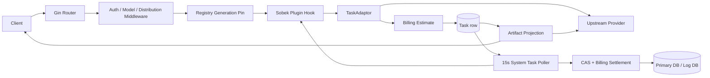
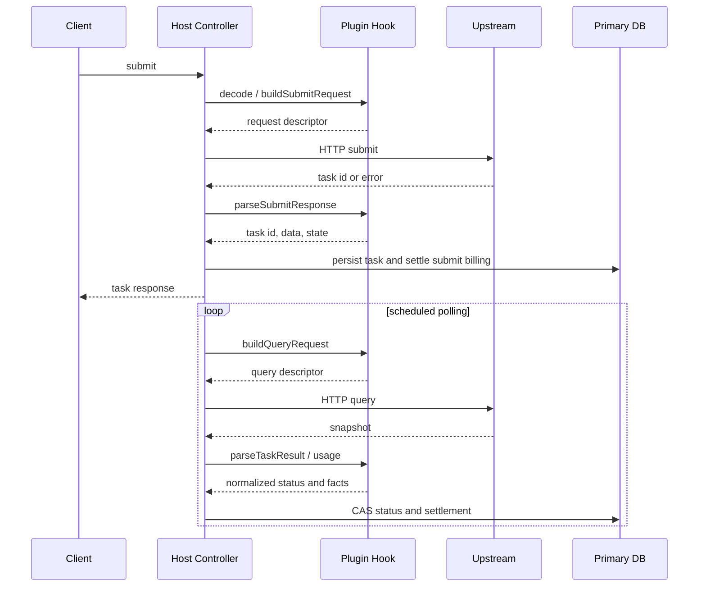
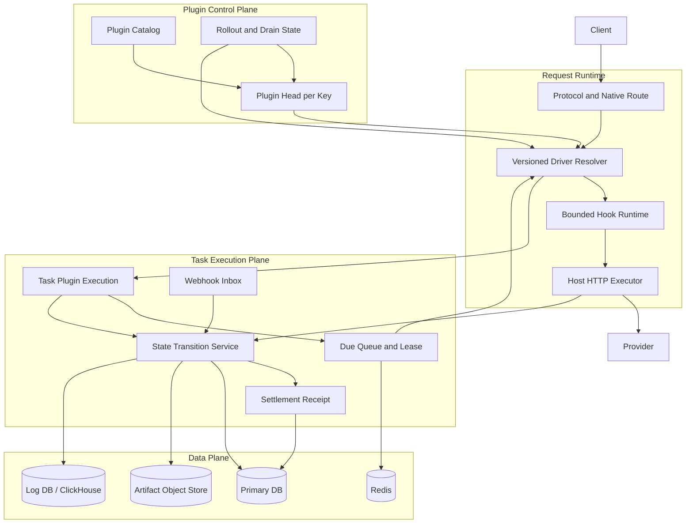
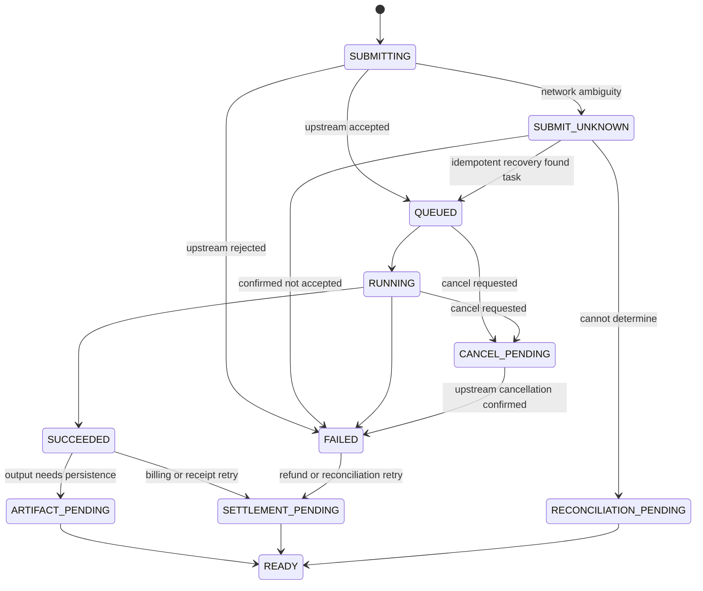

# 任务插件架构设计

文档状态：提案

基线分支：`custom/newapi-video`

基线提交：`28e880e37`

评审对象：当前任务插件框架、Doubao Video、Hailuo Video、OpenAI Video/Responses 兼容入口、异步轮询、计费结算和媒体产物访问链路。

## 1. 设计结论

当前框架已经具备可用的插件运行时和安全边界：插件只做同步数据转换，宿主拥有 HTTP、路由、认证、任务持久化、计费和结算；路由使用不可变 generation，任务使用 CAS 推进状态，H3 和 Seedance 的终态结算已经能够避免重复扣费。

当前最需要解决的不是继续给单个厂商插件增加分支，而是把以下几个隐含约束变成宿主强制的不变量：

1. 任务必须按提交时的插件版本执行查询、结算和产物投影。
2. 上游提交的结果必须区分“未接受”“已接受”“结果不确定”，不允许对可能已创建的任务盲目重试。
3. 轮询必须由每个任务自己的 `next_poll_at`、租约和重试策略驱动，不能依赖全局固定间隔和渠道内固定睡眠。
4. 任务状态、结算状态、产物状态和日志投递状态必须分开建模，不能都隐含在 `Task` 的 JSON 字段或错误文案中。
5. 供应商差异应收敛到版本化 Driver 和能力声明，协议渲染、计费事实、上游请求和管理操作不能在每个插件里重复实现。

静态审查没有发现已经被证实的 P0 问题，但这不等同于通过生产级故障演练。当前存在多项 P1 风险，尤其是插件升级、提交响应丢失、上游链接过期和删除后对账场景。

## 2. 范围和非目标

本设计覆盖：

- JavaScript task plugin 的 manifest、Sobek runtime、registry 和 routing generation。
- `buildSubmitRequest`、`parseSubmitResponse`、`buildQueryRequest`、`parseTaskResult`、usage hooks、artifact hooks 和管理操作 hooks。
- Generic Task API、原生厂商路由、`openai_video`、`openai_responses`。
- 任务提交、查询、轮询、超时、取消、删除、计费预扣、终态结算和产物访问。
- 插件版本发布、激活、回滚、多节点同步和测试/观测能力。

本设计不把以下内容塞进 task plugin：

- 钱包、Token、渠道使用量和退款算法。
- 任意 JavaScript 网络、文件系统或进程访问。
- 厂商凭证的明文管理。
- 私域素材库自身的业务表和素材审核规则。私域素材库仍由宿主服务管理，但未来可复用统一的 `MediaRef`。

## 3. 当前实现事实

### 3.1 现有分层

| 层 | 当前实现 | 宿主拥有的职责 |
| --- | --- | --- |
| 插件源代码 | `plugins/tasks/<key>/plugin.js`，单文件同步 ESM | 请求转换、响应解析、厂商状态和用量事实 |
| JS runtime | `pkg/jsplugin/engine.go`，Sobek、默认 hook 超时 5 秒、并发 8 | 编译、hook 执行、超时中断、运行时池、禁止 import/async/fetch |
| Registry | `pkg/jsplugin/registry.go`、`routing.go` | factory/override 层、版本加载、能力检查、路由冲突、generation 发布 |
| 路由 | `router/plugin-router.go`、`router/task-plugin-protocol-router.go` | native URL、host protocol、认证、模型选择、generation pin |
| 适配器 | `relay/channel/task/jsplugin/adaptor.go` | 将 JS 返回值转换为 Go descriptor，构造 HTTP 请求并限制响应大小 |
| 任务 | `model/task.go` | 用户归属、渠道、任务状态、`Task.Data`、`PluginState`、计费快照 |
| 轮询 | `service/task_polling.go`、`controller/system_task_handlers.go` | 按渠道取任务、查询上游、CAS 状态推进、终态结算 |
| 计费 | `service/task_billing.go`、`model/task_video_settlement.go`、`pkg/billingexpr` | 预扣、表达式、差额结算、退款、渠道和用户用量 |
| 产物 | `controller/task.go`、`controller/video_proxy.go`、`service/task_artifact_store.go` | 权限、能力 URL、SSRF 防护、上游代理。当前存储实现仍是 disabled |

### 3.2 当前两类视频插件

Doubao 和 Hailuo 都采用 `fetchMode: "per_task"`。它们分别在 JS 中维护模型能力矩阵、请求别名、媒体类型、状态映射、usage facts 和官方响应渲染。

- Doubao 通过原生路由和 `openai_video`/`openai_responses` 支持 Seedance 任务，模型能力、分辨率和输入媒体规则集中在 `plugins/tasks/doubao/plugin.js`。
- Hailuo 同时包含传统 Hailuo 模型、MiniMax-H3、H3-Context-IR 和视频再生成逻辑，`plugins/tasks/hailuo/plugin.js` 需要根据模型、动作和上游响应形态切换多套规则。
- 两个插件都依赖 `Task.Data` 保存最近一次上游快照，并通过 `listArtifacts`/`buildContentRequest` 访问视频产物。
- H3 和 Doubao 的原生管理路由已经能够把网关公开任务 ID 映射为真实上游 ID，宿主负责用户归属、渠道归属和取消/删除后的状态确认。

### 3.3 当前关键约束

- [Task Plugin API v1](plugin-api/v1.md) 是插件公开契约；`v1.schema.json` 和 `v1.d.ts` 是机器可读契约。
- 插件不能直接进行 I/O，只能返回宿主执行的请求 descriptor。
- `Task.Data` 是最近一次上游响应快照，`PrivateData.PluginState` 是插件跨轮次状态。
- `TaskExecutionSnapshot` 记录提交时插件 key、版本、作者和 generation，但当前主要用于审计和展示。
- `relay.GetTaskAdaptor` 默认从当前 registry generation 获取插件；轮询和产物读取没有普遍按照任务快照恢复提交时的插件对象。
- 任务插件管理操作当前以 native route 的 `list` 和 `delete` 为主，通用 API 没有统一的 cancel/retry/operation contract。
- `TaskArtifactStore` 接口已经预留，但当前始终返回 disabled store，视频通常直接代理上游 URL 或文件接口。

## 4. 当前请求和任务链路



提交和异步任务的当前顺序可概括为：



这条链路的优点是业务责任集中在宿主，缺点是提交接受和持久化之间存在不确定窗口，任务执行版本、轮询调度和媒体保存也没有完整的独立状态模型。

## 5. 缺陷和风险分级

分级含义：

- P0：会造成跨用户数据泄露、不可控资金损失或大面积服务不可用，且触发条件常见。
- P1：在正常故障、升级或高负载场景下会造成任务丢失、资金长期悬挂、重复上游任务或核心功能不可用。
- P2：不会立即破坏账务，但会增加扩展成本、运维成本或边界故障概率。

### 5.1 P1

| 编号 | 风险 | 代码事实和触发条件 | 影响 | 根因修复 |
| --- | --- | --- | --- | --- |
| P1-01 | 任务没有强制使用提交时插件版本 | `TaskExecutionSnapshot` 保存了版本，但 `relay.GetTaskAdaptor` 和后台轮询默认读取当前 generation。新版本只要改变 query/parser/usage 行为，旧任务就会被新代码处理。 | 升级后旧任务可能无法查询、错误结算或无法生成产物；文档目前只是要求插件作者保持兼容，宿主没有强制。 | 建立按 `PluginRef(key, apiVersion, version, sourceHash)` 获取 Driver 的 resolver。任务执行表保存不可变 ref，缺失版本时进入 `plugin_version_unavailable`，不能静默回退到新版本完成结算。 |
| P1-02 | 提交结果不确定时可能重复创建上游任务 | `TaskAdaptor.ParseResponse` 对已接受 SSE 设置 `NoRetry`，普通 JSON 读取/解析失败没有同等的“可能已接受”语义；`shouldRetryTaskRelay` 对部分 5xx/非本地错误继续重试。上游可能已经创建任务，但响应在网关或网络边界丢失。 | 同一用户请求可能创建多个视频，产生重复上游成本、多个本地任务或难以对账的预扣。 | 让 descriptor 声明 retry class 和 idempotency 能力。为每次逻辑提交生成稳定幂等键；结果分为 `rejected`、`accepted`、`unknown`。`unknown` 只能进入恢复查询或明确待处理状态，不得盲目换渠道重试。 |
| P1-03 | 轮询吞吐和公平性受固定策略限制 | 调度器默认每 15 秒运行一次；`TASK_QUERY_LIMIT` 默认 1000；同一渠道任务之间默认睡眠 1 秒；任务没有 `next_poll_at`、每任务租约和 provider 级速率预算。 | 一个慢渠道或大量未完成任务会拖长整轮，其他任务延迟变大；高并发下上游 429 增多，数据库也会反复扫描未完成任务。 | 将轮询拆成可索引的 due queue，按任务租约领取；支持 provider hint、指数退避、`Retry-After`、批量大小和公平调度。为未完成任务增加组合索引或独立执行表。 |
| P1-04 | 任务历史和媒体历史不是同一份持久化承诺 | `service/task_artifact_store.go` 当前返回 disabled store；视频内容通常依赖上游 `file_id` 或有时效的 CDN URL。H3/Seedance 返回的 URL 可能在一天后失效，而任务行仍然存在。 | 页面能看到任务成功，但过期后预览和下载失败；用户无法判断是任务失败、上游链接过期还是网关存储失败。 | 引入宿主拥有的 artifact lifecycle。成功任务将产物异步复制到配置的对象存储或本地后端，只有复制完成才标记 `stored`；上游代理作为明确的临时降级路径并带状态展示。 |
| P1-05 | 删除竞态后的资金对账状态不完整 | 删除前同步失败或上游已删除时，代码可以把任务置为“保留预扣待对账”的失败状态并返回 503。现有 `video_task_pending_logs` 只负责独立日志库投递，没有单独的资金 reconciliation job/status。 | 预扣额度可能长期悬挂；任务表显示 FAILURE 但 quota 非零，普通失败筛选和运维脚本容易漏掉它。 | 增加 `settlement_status` 和 reconciliation record。删除/取消产生可重试的对账任务；在没有可靠终态证据时保持 `SETTLEMENT_PENDING`，不把它伪装成普通 FAILURE。 |
| P1-06 | 插件激活缺少每个 key 的单一生效版本约束 | `ActivateTaskPlugin` 在事务中批量清除 `active` 后再设置目标行，数据库没有跨 SQLite/MySQL/PostgreSQL 通用的“每 key 只有一行 active”约束，也没有先锁定 key head。并发激活可能留下多个 active 行。 | 不同节点或不同查询可能拿到不同版本；同步 revision 和回滚行为不再可靠。 | 使用每个插件 key 一行的 `task_plugin_heads` 作为生效指针，在事务中锁定 head 并更新目标版本；历史版本只读保留。旧 `active` 字段作为过渡字段，最终由 head 统一生成。 |

### 5.2 P2

| 编号 | 风险 | 当前表现 | 建议 |
| --- | --- | --- | --- |
| P2-01 | Hook contract 主要在运行期通过 `map[string]any` 检查 | 编译阶段主要检查 export 存在，descriptor、usage、task result 的字段错误往往要到真实请求才暴露。 | 用单一 schema 生成 JS/Go 类型定义；加载时检查 descriptor 静态形状，运行时只接受版本化 normalized result。 |
| P2-02 | 厂商能力和兼容入口重复实现 | Doubao/Hailuo 在 native、Responses、OpenAI Video、polling、usage 和 artifact 之间重复解析字段，单文件已经很大。 | 把“模型能力矩阵”“内容规范化”“状态表”“用量提取”拆成 Driver 子模块；协议入口只做映射，不再复制供应商规则。 |
| P2-03 | 管理操作模型过窄 | 当前 action 主要围绕 list/delete，`ExecuteTaskAction` 限制为认证 JSON 请求，delete 还要求 DELETE；需要 POST cancel、retry、补偿查询或额外 body 的供应商无法直接声明。 | 增加 declarative operation contract：`cancel`、`delete`、`retry`、`refresh` 等操作声明方法、输入 schema、响应 parser 和状态前置条件。 |
| P2-04 | 凭证类型由宿主硬编码，OAuth 缓存没有明确淘汰 | `AuthMeta` 只有少数 type，OAuth cache 使用进程级 `sync.Map`，过期项只在同 key 再次访问时覆盖。 | 引入宿主 CredentialProvider 和有界 TTL/LRU cache；插件只拿 opaque credential handle 或已签名 header，不直接理解凭证格式。 |
| P2-05 | 只有轮询事件源，没有 webhook 事件模型 | 所有异步 provider 都要靠后台轮询；没有签名验证、重复事件、乱序事件和回放语义。 | 增加可选 webhook capability。事件先落 outbox/inbox，再与轮询共享同一状态机和结算收据。 |
| P2-06 | Task.Data/PluginState 是有界 JSON，但没有 schema/version/ref | 每次成功轮询会覆盖 `Task.Data`，插件状态最大 1 MiB；大响应、长工作流和跨版本状态只能由插件自行兼容。 | 持久化 `data_schema_version`、`state_schema_version` 和外部 blob ref；状态迁移由插件声明，宿主限制大小和深度。 |
| P2-07 | 运行时缺少插件级熔断和资源指标 | 有 DEBUG 生命周期日志和 hook timeout，但没有稳定的 plugin/model/operation 指标、队列深度、拒绝率、hook p95 或熔断状态。 | 统一采集 hook、上游请求、轮询、结算和产物指标；按插件 key/version 和 operation 维度限流、熔断和告警。 |
| P2-08 | Sobek 不是硬内存隔离边界 | API 文档已经明确插件上传是管理员信任决策；source、state、response 有大小限制，但没有进程级 heap quota。 | 低信任 marketplace 使用 worker process 或 WASM 隔离；至少补充每插件 CPU、内存近似指标、并发和连续超时熔断。 |
| P2-09 | 多节点同步是最终一致，缺少发布协调 | 当前节点通过数据库 revision 和周期同步获得 override，generation number 只是节点本地值。 | 把发布版本和 rollout state 放在 control-plane 表中；节点报告已加载 ref，发布完成前提供版本差异和 drain 状态。 |
| P2-10 | API 文档、manifest 和测试 fixture 需要手工同步 | `v1.md`、schema、d.ts、插件源码和前端价格表各自维护，新增能力容易遗漏其中一层。 | 以 contract schema 为源生成文档、d.ts、fixture 骨架和 marketplace display metadata，并在 CI 中检查漂移。 |

### 5.3 当前没有确认的 P0

当前代码审查没有发现以下已经成立的 P0：

- 未发现 native query 可以绕过用户归属查询任意用户任务的路径，相关接口使用用户条件和插件平台校验。
- 未发现普通终态轮询会因为重复请求直接重复退款，当前关键视频路径使用 CAS 或原子结算。
- 未发现插件 JS 可以直接调用宿主 `fetch`、文件系统或环境变量。

以上结论仍需要多节点、Redis 故障、数据库故障、上游接受后断链和产物过期的集成演练来确认。

## 6. 目标架构

### 6.1 目标分层



每个层只拥有一种主职责：

- Control Plane 管理插件源、版本、激活指针和发布状态。
- Request Runtime 负责一次请求期间的 generation 和 Driver pin。
- Task Execution Plane 负责异步任务的生命周期，不让控制器和单个插件自行决定最终状态。
- Data Plane 保存任务执行、结算收据、产物和审计事件。

### 6.2 核心对象

#### PluginRef

不可变插件身份至少包含：

```text
key        = hailuo
apiVersion = 1
version    = 1.3.7
sourceHash = sha256...
```

`version` 不是展示字段，而是后台查询和结算可执行代码的选择条件。`sourceHash` 防止相同 key/version 被替换为不同源。

#### ExecutionRef

每个任务在接受上游任务后拥有一份不可变执行引用：

```text
taskRowId
pluginRef
protocol       = openai_video | openai_responses | native
operation      = generation | regeneration | cancel | ...
channelId
upstreamTaskId
idempotencyKey
billingSchemaHash
```

#### NormalizedTaskResult

插件只能返回宿主定义的结果，不直接修改数据库：

```json
{
  "status": "QUEUED | IN_PROGRESS | SUCCESS | FAILURE | UNKNOWN",
  "progress": "50%",
  "data": {},
  "state": {},
  "usage_facts": {},
  "artifact_refs": [],
  "error": {"code": "", "message": "", "retryable": false},
  "poll": {"next_after_seconds": 10, "retry_after_seconds": 0}
}
```

宿主负责校验状态、数量、大小、重试语义和账务边界。插件不能返回 host quota、退款金额或用户余额。

#### SettlementReceipt

终态结算必须有宿主生成的幂等收据：

```text
execution_id
phase          = submit_reserve | complete_settle | cancel_refund | reconcile
attempt_key
reserved_quota
actual_quota
delta
status         = pending | applied | failed
created_at
applied_at
```

同一个 execution 和 phase 只能成功应用一次。日志投递收据和资金结算收据是两类对象，不能混用。

### 6.3 推荐的持久化模型

保留现有 `task_plugins` 作为插件源码版本表，新增宿主拥有的独立执行表。这样可以把高频查询从 `Task.PrivateData` JSON 中移出，也不要求在 `Task` 大表上不断增加供应商字段。

| 表 | 关键字段 | 作用 |
| --- | --- | --- |
| `task_plugin_heads` | `plugin_key`、`version`、`source_hash`、`updated_at` | 每个 key 的唯一激活指针，支持并发激活和回滚 |
| `task_plugin_executions` | `task_id`、plugin ref、protocol、operation、channel、upstream id、next poll、lease、attempt、settlement status | 异步执行主索引和版本 pin |
| `task_plugin_settlements` | execution、phase、reserved/actual/delta、receipt status | 结算幂等和对账 |
| `task_plugin_artifacts` | execution、artifact key/type、source ref、storage ref、status、hash、size、mime | 产物状态和长期访问 |
| `task_plugin_operations` | task、operation、idempotency key、request status、response class、attempt | cancel/delete/retry 等管理操作 |
| `task_plugin_events` | execution、source、event id、sequence、payload ref、processed status | webhook/inbox 和可回放事件 |

所有表都必须通过 GORM migration 同时支持 SQLite、MySQL 和 PostgreSQL。不要依赖 PostgreSQL partial unique index、MySQL 专有 JSON operator 或 SQLite 不支持的 `ALTER COLUMN`。

### 6.4 目标状态机

对外仍可映射为现有任务状态；内部状态需要表达“任务已经完成但资金或产物还未完成”。



`READY` 不是新的用户可见状态，而是内部表示任务的所有必要后处理已完成。产物保存失败不应伪造生成失败，资金结算失败也不应再次执行生成。

## 7. 扩展原则

### 7.1 保持 API v1，使用版本化 capability 扩展

能以加法表达的能力继续使用 `apiVersion: 1`，例如：

```text
submit-idempotency@1
poll-schedule@1
webhook-inbox@1
artifact-store@1
management-actions@1
media-ref@1
```

宿主只接受明确知道的 capability 版本。改变既有 hook 参数、字段含义或状态映射时才提升 API version。能力声明只说明宿主是否提供契约，不把权限直接交给 JavaScript。

### 7.2 Driver 与协议渲染分离

一个供应商 Driver 只实现：

- 供应商请求构造。
- 供应商响应解析。
- 状态和 usage facts。
- 产物 source ref。
- 声明的管理操作。

`openai_video`、`openai_responses` 和厂商 native route 是三种 presentation adapter。它们可以使用同一个 Driver 结果，不能分别复制供应商校验和结算逻辑。

### 7.3 把模型能力变成数据

当前 `modelCapabilities`、分辨率、动作和输入媒体规则都写在插件函数中。目标是让每个 model profile 声明：

```json
{
  "model": "doubao-seedance-2-0-fast-260128",
  "operations": ["generation"],
  "inputs": ["text", "image", "video"],
  "resolutions": ["480p", "720p"],
  "duration": {"min": 4, "max": 15, "supports_auto": true},
  "usage": "seedance-v2"
}
```

请求验证、价格编辑器、usage 估算、完成结算和文档测试都读取同一份 profile，减少 native/compatible 入口漂移。

### 7.4 让输入媒体成为统一引用

未来统一使用 `MediaRef` 表达 URL、上传文件、私域素材、对象存储对象和源任务产物：

```json
{
  "id": "media_...",
  "kind": "image | video | audio",
  "mime_type": "image/png",
  "size": 123456,
  "sha256": "...",
  "storage": "private_asset | task_artifact | upstream_url",
  "duration_seconds": 0,
  "access_scope": "user"
}
```

插件只接收经过宿主授权的引用和必要的元数据，不直接接触长期凭证。宿主可以在 request builder 中把引用转换为 URL、multipart 文件或上游 asset id。

## 8. 安全、性能和可观测性

### 8.1 安全不变量

- 所有任务读写必须经过 user、plugin key、channel 和 execution ref 的联合校验。
- 上游 task id 只存在于宿主执行层和受控 Driver context，不进入公开 task id。
- 公开产物 URL 使用短期 capability，或者只返回网关 artifact URL；禁止把带签名的上游 URL 当作长期公共契约。
- 插件错误和上游错误保留 request id，但必须脱敏 token、URL query secret、cookie、Authorization 和上游私有 ID。
- 插件日志默认结构化并自动屏蔽凭证；`console.log` 不应成为生产诊断的唯一手段。

### 8.2 性能预算

必须观察而不是猜测以下指标：

| 指标 | 目标约束 |
| --- | --- |
| 每任务上游提交次数 | 幂等 provider 为 1；不确定结果不得无保护重试 |
| 每任务轮询次数 | 由 provider 状态和 backoff 决定；不能因 parser 失败无限高速重试 |
| 每任务 Task DB 写入 | 按状态变化或有意义快照写入，不能每次读取都全量 Save |
| 每任务结算收据应用次数 | 每个 phase 最多一次成功应用 |
| Redis 操作 | 受限于批量/缓存策略，Redis 故障时队列必须有界 |
| Hook p95/p99 | 按插件 key、version、hook 统计，并支持熔断 |
| Poll lag | `now - next_poll_at`，用于发现调度饥饿 |
| Artifact copy lag | 终态到 `stored` 的时间和失败率 |

当前性能指标记录可继续使用内存聚合和周期落库，但不要把它作为任务状态的可靠来源。性能指标丢失不能影响计费和任务结算。

### 8.3 失败隔离

插件 hook 超时、上游 429、上游 5xx、解析失败、数据库失败和对象存储失败要有独立分类。单个插件的错误不得阻塞其他插件的 generation 发布、调度或请求。

## 9. 发布和兼容策略

### 9.1 插件升级

1. 编译、schema 检查、fixture 回放和静态安全检查通过后才允许进入 catalog。
2. 激活只更新 `task_plugin_heads`，历史版本不删除，直到没有 in-flight execution 引用。
3. 新任务使用 head；旧任务使用自己的 `PluginRef`。
4. 新版本在小流量或单节点加载后报告健康状态，所有节点确认加载后再完成 rollout。
5. 回滚只移动 head，不修改已有 task execution 的版本。

### 9.2 旧任务

- 已经有 `TaskExecutionSnapshot` 的任务可按 snapshot 补建 execution row。
- 没有插件版本快照的历史任务必须标记为 legacy；只有在明确配置兼容版本时才允许继续查询。
- 不应为了让旧任务“看起来成功”而使用新插件猜测旧数据或重新执行计费。

### 9.3 失败回滚

- registry generation 发布失败时保留上一 generation。
- Driver 版本缺失时保留任务和预扣，生成可操作的 `plugin_version_unavailable` 对账项。
- object store 失败时保留上游 source ref 和 `artifact_pending`，不重复生成任务。
- settlement receipt 重试必须使用同一个 receipt key，不能创建新的资金事件。

## 10. 实施顺序

实施顺序按风险和依赖排列：

1. P1-01、P1-06：插件 ref、head、按版本 resolver 和 activation race 修复。
2. P1-02、P1-05：提交幂等键、不确定结果状态、结算收据和对账状态。
3. P1-03：due queue、lease、backoff、provider rate budget 和轮询索引。
4. P1-04：artifact 表、对象存储实现、预览/下载状态和过期降级。
5. P2-01、P2-02、P2-10：typed normalized contract、model profile 和 contract generation。
6. P2-03、P2-05、P2-06：通用管理操作、webhook inbox、状态 schema 和 blob ref。
7. P2-04、P2-07、P2-08、P2-09：credential provider、资源隔离、可观测性和多节点 rollout。

每一步都必须保持现有插件可运行，新增能力通过 capability 声明启用，不能先改变已有 v1 hook 的语义再补迁移。

## 11. 待确认决策

以下决策会影响实现细节，应在开发设计评审时确认：

1. 默认产物保存策略是“所有成功视频保存”还是按插件/模型/用户组配置。
2. 对不支持幂等键的 provider，提交响应不确定时是进入人工对账，还是允许一次受控的同渠道恢复查询。
3. 任务和产物保留期是否独立；产物通常比任务数据更大，不能共用一个 TTL。
4. marketplace 插件的运行隔离是否第一阶段就使用 worker process，还是先限制为管理员信任源。
5. webhook 是否由网关暴露统一 endpoint，还是由插件声明 provider-specific callback path。
